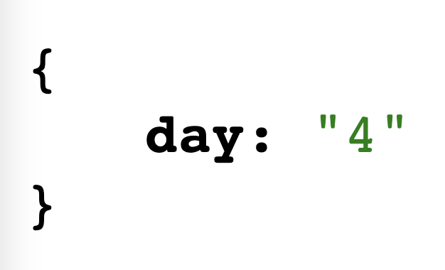

# Parkland-High-School-day-scrapper
A neat scrapper made in node.js, express, and puppeteer to scrape what day it is at Parkland High School

## To run the programm
First, make sure you have node.js already installed. Then, just cd into the directory of this folder and type npm install on the terminal. It should hopefully install all the required node modules and then just type node index.js to start the server locally. Then go to localhost with the port number it gives you and it should take anywhere from 5 seconds to 15 seconds to load the page and return the day in JSON format.

